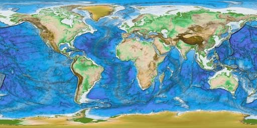
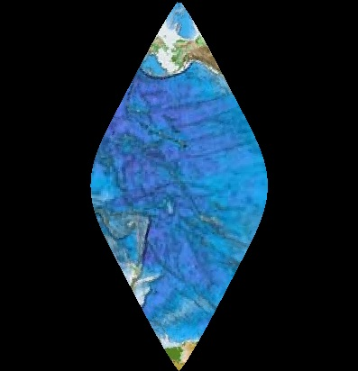
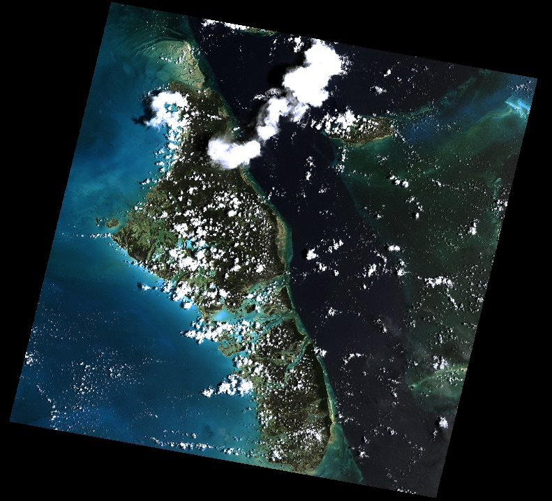
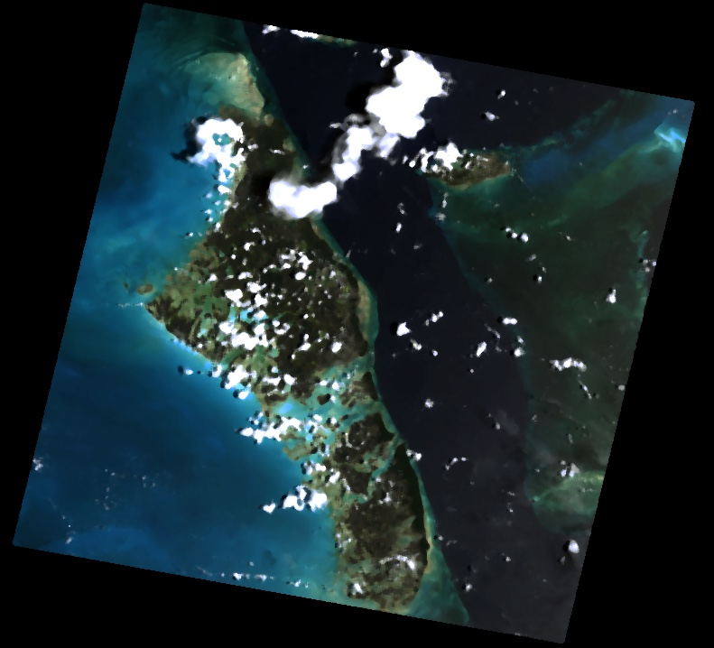

=================
Rasterio Cookbook
=================

.. todo::

    Fill out examples of using rasterio to handle tasks from typical
    GIS and remote sensing workflows.

The Rasterio cookbook is intended to provide in-depth examples of rasterio usage
that are not covered by the basic usage in the User's Manual. Before using code
from the cookbook, you should be familar with the basic usage of rasterio; see
"Reading Datasets", "Working with Datasets" and "Writing Datasets" to brush up on
the fundamentals.

Generating summary statistics for each band
-------------------------------------------

.. literalinclude:: recipies/band_summary_stats.py
    :language: python
    :linenos:

.. code::

    $ python docs/recipies/band_summary_stats.py
    [{'max': 255, 'mean': 29.94772668847656, 'median': 13.0, 'min': 0},
     {'max': 255, 'mean': 44.516147889382289, 'median': 30.0, 'min': 0},
     {'max': 255, 'mean': 48.113056354742945, 'median': 30.0, 'min': 0}]

Raster algebra
--------------

Resampling rasters to a different cell size
--------------------------------------------

Reproject/warp a raster to a different CRS
------------------------------------------

Reproject to a Transverse Mercator projection, Hawaii zone 3 (ftUS),
aka EPSG code 3759. 

.. literalinclude:: recipies/reproject.py
    :language: python
    :linenos:

.. code::

    $ python docs/recipies/reproject.py

The original image

Warped to ``EPSG:3759``. Notice that the bounds are contrainted to the new projection's
valid region (``CHECK_WITH_INVERT_PROJ=True`` on line 13) and the new raster is wrapped seamlessly across the anti-meridian.

Raster to polygon features
--------------------------

Rasterizing GeoJSON features
----------------------------

Masking raster with a polygon feature
-------------------------------------

.. literalinclude:: recipies/mask_shp.py
    :language: python
    :linenos:

.. code::

    $ python docs/recipies/mask_shp.py

The original image with the shapefile overlayed

.. image:: img/box_rgb.jpg
    :scale: 50 %

Masked and cropped to the geometry

.. image:: img/box_masked_rgb.jpg
    :scale: 50 %

Creating valid data bounding polygons
-------------------------------------

Raster to vector line feature
-----------------------------

Creating raster from numpy array
--------------------------------

Creating a least cost path
--------------------------

Using a scipy filter to smooth a raster
---------------------------------------

This recipie demonstrates the use of scipy's `signal processing filters <http://docs.scipy.org/doc/scipy/reference/signal.html#signal-processing-scipy-signal>`_ to manipulate multi-band raster imagery
and save the results to a new GeoTIFF. Here we apply a median filter to smooth
the image and remove small inclusions (at the expense of some sharpness and detail).

.. literalinclude:: recipies/filter.py
    :language: python
    :linenos:

.. code::

    $ python docs/recipies/filter.py

The original image

With median filter applied

Using skimage to adjust the saturation of a RGB raster
------------------------------------------------------

This recipie demonstrates the use of manipulating color with the scikit image `color module <http://scikit-image.org/docs/stable/api/skimage.color.html>`_.

.. literalinclude:: recipies/saturation.py
    :language: python
    :linenos:

.. code::

    $ python docs/recipies/saturation.py

The original image

With increased saturation

.. image:: img/saturation.jpg
    :scale: 50 %
