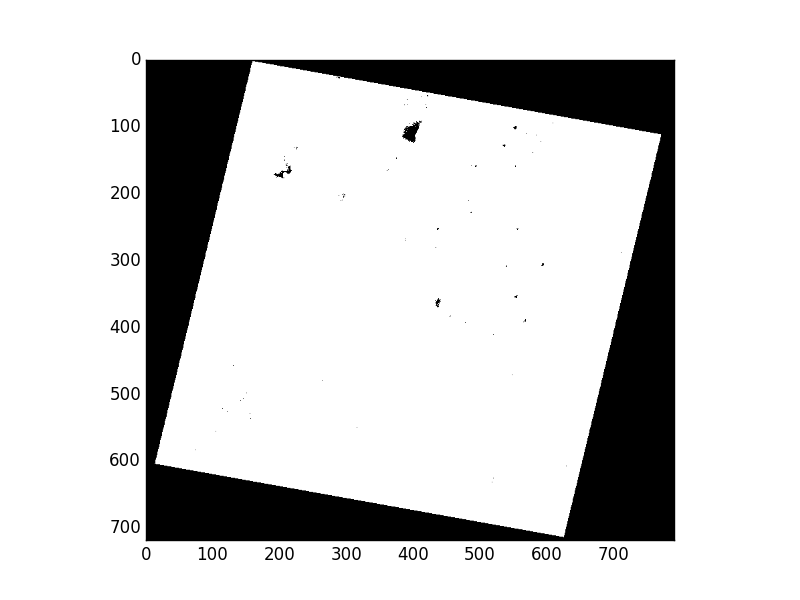

Masks
=====

In using Rasterio, you'll encounter two different kinds of masks. One is the
the valid data mask from GDAL, an unsigned byte array with the same number of
rows and columns as the dataset in which non-zero elements indicate that the
corresponding data elements are valid. Other elements are invalid, or *nodata*
elements. The other kind of mask is the mask in Numpy's [masked
arrays](http://docs.scipy.org/doc/numpy/reference/maskedarray.generic.html),
which have the inverse sense: `True` values in a masked array's mask indicate
that the corresponding data elements are invalid. With care, you can safely
navigate this divide.

Here's the Rasterio's RGB.byte.tif test dataset. It has 718 rows and 791
columns of pixels. Each pixel has 3 8-bit (uint8) channels or bands.  As
Landsat scenes do, it has a trapezoid of image data within a rectangular
background of 0,0,0 value pixels.

.. image:: https://www.dropbox.com/s/sg7qejccih5m4ah/RGB.byte.jpg?dl=1

Metadata in the dataset declares that values of 0 shall be interpreted as
invalid data or *nodata* pixels. In, e.g., merging the image with adjacent
scenes, we'd like to ignore the nodata pixels and have only valid image data in
our final mosaic.

Let's use the rio-insp command to look at the two kinds of masks and their
inverse relationship in the context of RGB.byte.tif.

.. code-block:: console

    $ rio insp tests/data/RGB.byte.tif
    Rasterio 0.19dev0 Interactive Inspector (Python 2.7.9)
    Type "src.meta", "src.read_band(1)", or "help(src)" for more information.
    >>> src.shape
    (718, 791)
    >>> src.count
    3
    >>> src.dtypes
    ['uint8', 'uint8', 'uint8']
    >>> src.nodatavals
    [0.0, 0.0, 0.0]

The dataset mask
----------------

The dataset's mask band can be read using its ``read_mask()`` method.

.. code-block:: python

    >>> m = src.read_mask()
    >>> m
    array([[0, 0, 0, ..., 0, 0, 0],
           [0, 0, 0, ..., 0, 0, 0],
           [0, 0, 0, ..., 0, 0, 0],
           ...,
           [0, 0, 0, ..., 0, 0, 0],
           [0, 0, 0, ..., 0, 0, 0],
           [0, 0, 0, ..., 0, 0, 0]], dtype=uint8)

This array is a valid data mask in the sense of `GDAL RFC 15
<https://trac.osgeo.org/gdal/wiki/rfc15_nodatabitmask>`__. The 0 values in its
corners represent *nodata* regions. Zooming in on the interior of the mask
array shows the ``255`` values that indicate valid data regions.

.. code-block:: python

    >>> m[200:250,200:250]
    array([[255, 255, 255, ..., 255, 255, 255],
           [255, 255, 255, ..., 255, 255, 255],
           [255, 255, 255, ..., 255, 255, 255],
           ...,
           [255, 255, 255, ..., 255, 255, 255],
           [255, 255, 255, ..., 255, 255, 255],
           [255, 255, 255, ..., 255, 255, 255]], dtype=uint8)

Displayed using Matplotlib's `imshow()`, the mask looks like this:

Mask identities
---------------

Here's a handy identity:

$ rio insp tests/data/RGB.byte.tif
Rasterio 0.19dev0 Interactive Inspector (Python 2.7.9)
Type "src.meta", "src.read_band(1)", or "help(src)" for more information.
>>> (~src.read_mask().astype('bool') == src.read(1).mask).all()
True

Reading masks
-------------

There are a few different ways for raster datasets to carry valid data masks.
Rasterio subscribes to GDAL's abstract mask band interface, so although the
module's main test dataset has no mask band, GDAL will build one based upon
its declared nodata value of 0.

.. code-block:: python
    
    import rasterio

    with rasterio.open('tests/data/RGB.byte.tif') as src:
        mask = src.read_mask()
        print mask.any()
        count = mask.shape[0] * mask.shape[1]
        print float((mask > 0).sum())/count
        print float((mask == 0).sum())/count

Some of the elements of the mask evaluate to ``True``, meaning that there is some
valid data. Just over 2/3 of the dataset's pixels (use of sum being a neat trick for
computing the number of pixels in a selection) have valid data.

.. code-block:: console

    True
    0.673974976142
    0.326025023858

Writing masks
-------------

Writing a mask is just as straightforward: pass an ndarray with ``True`` (or values
that evaluate to ``True`` to indicate valid data and ``False`` to indicate no data
to ``write_mask()``.

.. code-block:: python

    import os
    import shutil
    import tempfile

    import numpy
    import rasterio

    tempdir = tempfile.mkdtemp()

    with rasterio.open(
            os.path.join(tempdir, 'example.tif'), 
            'w', 
            driver='GTiff', 
            count=1, 
            dtype=rasterio.uint8, 
            width=10, 
            height=10) as dst:
        
        dst.write_band(1, numpy.ones(dst.shape, dtype=rasterio.uint8))

        mask = numpy.zeros(dst.shape, rasterio.uint8)
        mask[5:,5:] = 255
        dst.write_mask(mask)

    print os.listdir(tempdir)
    shutil.rmtree(tempdir)

The code above masks out all of the file except the lower right quadrant and 
writes a file with a sidecar TIFF to hold the mask.

.. code-block:: console

    ['example.tif', 'example.tif.msk']

To use an internal TIFF mask, use the ``drivers()`` option shown below:

.. code-block:: python

    tempdir = tempfile.mkdtemp()
    tiffname = os.path.join(tempdir, 'example.tif')

    with rasterio.drivers(GDAL_TIFF_INTERNAL_MASK=True):

        with rasterio.open(
                tiffname,
                'w', 
                driver='GTiff', 
                count=1, 
                dtype=rasterio.uint8, 
                width=10, 
                height=10) as dst:
            
            dst.write_band(1, numpy.ones(dst.shape, dtype=rasterio.uint8))

            mask = numpy.zeros(dst.shape, rasterio.uint8)
            mask[5:,5:] = 255
            dst.write_mask(mask)

    print os.listdir(tempdir)
    print subprocess.check_output(['gdalinfo', tiffname])

The output:

.. code-block:: console

    ['example.tif']
    Driver: GTiff/GeoTIFF
    Files: /var/folders/jh/w0mgrfqd1t37n0bcqzt16bnc0000gn/T/tmpcnGV_r/example.tif
    Size is 10, 10
    Coordinate System is `'
    Image Structure Metadata:
      INTERLEAVE=BAND
    Corner Coordinates:
    Upper Left  (    0.0,    0.0)
    Lower Left  (    0.0,   10.0)
    Upper Right (   10.0,    0.0)
    Lower Right (   10.0,   10.0)
    Center      (    5.0,    5.0)
    Band 1 Block=10x10 Type=Byte, ColorInterp=Gray
      Mask Flags: PER_DATASET
