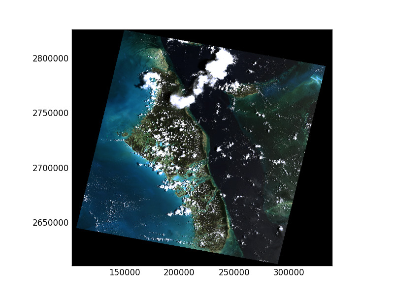

Plotting
********

.. todo::

Rasterio reads raster data into numpy arrays so plotting a single band as
two dimensional data can be accomplished directly with ``pyplot``.

.. code-block:: python

    >>> import rasterio
    >>> from matplotlib import pyplot
    >>> src = rasterio.open("tests/data/RGB.byte.tif")
    >>> pyplot.imshow(src.read(1), cmap='pink')
    <matplotlib.image.AxesImage object at 0x...>
    >>> pyplot.show()  # doctest: +SKIP

.. image:: http://farm6.staticflickr.com/5032/13938576006_b99b23271b_o_d.png

Rasterio also provides ``rasterio.plot.show`` to perform common tasks such as
displaying multi-band images as RGB and labeling the axes with proper geo-referenced extents.

The first argument to ``show`` represent the data source to be plotted. This can be one of

   * A ``RasterReader`` source instance
   * A single band of a source, represented by a ``(src, band_index)`` tuple
   * A numpy ndarray, 2D or 3D. If the array is 3D, ensure that it is in rasterio band order.

Thus the following operations for 3-band RGB data are equivalent:

.. code-block:: python

    >>> from rasterio.plot import show
    >>> show(src)
    >>> show(src.read())

and similarly for single band plots. Note that you can pass in ``cmap`` to
specify a matplotlib color ramp. Any kwargs passed to ``show`` will passed
through to the underlying pyplot functions.

.. code-block:: python

    >>> show((src, 2), cmap='viridis')
    >>> show(src.read(2), cmap='viridis')

.. image:: img/singleband.jpg

You can create a figure with multiple subplots by passing the ``show(..., ax=ax1)``
argument. Also note that this example demonstrates setting the overall figure size
and sets a title for each subplot.

.. code-block:: python

    >>> fig, (axr, axg, axb) = plt.subplots(1,3, figsize=(21,7))
    >>> show((src, 1), ax=axr, cmap='Reds', title='red channel')
    >>> show((src, 2), ax=axg, cmap='Greens', title='green channel')
    >>> show((src, 3), ax=axb, cmap='Blues', title='blue channel')

.. image:: img/subplots.jpg

For single-band rasters, there is also an option to generate contours.

.. code-block:: python

    >>> fig, ax = plt.subplots(1, figsize=(12, 12))
    >>> plot.show((src, 1), cmap='Greys_r', interpolation='none', ax=ax)
    >>> plot.show((world, 1), contour=True, ax=ax)

.. image:: img/contours.jpg

Rasterio also provides a ``plot.show_hist`` function for generating histograms of
single or multiband rasters:

.. code-block:: python

    >>> plot.show_hist(
    ...     src, bins=50, lw=0.0, stacked=False, alpha=0.3,
    ...     histtype='stepfilled', title="Histogram")

.. image:: img/hist.jpg
