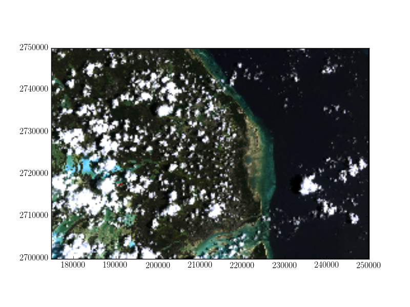

Masking a raster using a shapefile
==================================
Using ``rasterio`` with ``fiona``, it is simple to open a shapefile, read geometries, and mask out regions of a raster that are outside the polygons defined in the shapefile.

.. code-block:: python

        import fiona
        import rasterio
        import rasterio.mask

        with fiona.open("tests/data/box.shp", "r") as shapefile:
            shapes = [feature["geometry"] for feature in shapefile] 

This shapefile contains a single polygon, a box near the center of the raster, so in this case, our list of features is one element long.

.. code-block:: python

        with rasterio.open("tests/data/RGB.byte.tif") as src:
            out_image, out_transform = rasterio.mask.mask(src, shapes, crop=True)
            out_meta = src.meta

Using  :func:`matplotlib.pyplot.plot` and :func:`matplotlib.pyplot.imshow`, we can see the region defined by the shapefile in red overlaid on the original raster.

.. image:: ../img/box_rgb.png

Applying the features in the shapefile as a mask on the raster sets all pixels outside of the features to be zero. Since ``crop=True`` in this example, the extent of the raster is also set to be the extent of the features in the shapefile. We can then use the updated spatial transform and raster height and width to write the masked raster to a new file.

.. code-block:: python

        out_meta.update({"driver": "GTiff",
                         "height": out_image.shape[1],
                         "width": out_image.shape[2],
                         "transform": out_transform})

        with rasterio.open("RGB.byte.masked.tif", "w", **out_meta) as dest:
            dest.write(out_image) 

